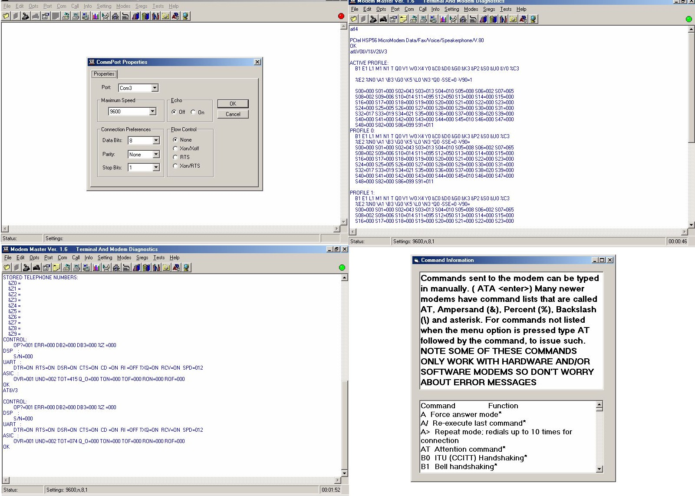



## Modem Diagnostics

### Description

Modem Master Diagnostics 1.6 reports and checks your modem status in over a 100 ways: Independent S-Register status, Internal Profiles, and Resets. Checks Nvram, Product ID, Checksums, and Product Codes. Loads and edits Profiles. Reports DCE, DTE and Compression information. Identifies stored numbers, control settings, and fax classes. Does analog and digital loopback and internal echo tests. Checks line signal strength and noise DB levels. Works on COM ports 1 to 16 at 110 to 256000 BPS. Also works as a dial-up terminal. Fully configurable with Edit, Copy, Paste and Print functions of tested functions.
 
### More Info
 
Reports and checks your modem status in over a 100 ways: Independent S-Register status, Internal Profiles, and Resets. Checks Nvram, Product ID, Checksums, and Product Codes. Loads and edits Profiles. Reports DCE, DTE and Compression information. Identifies stored numbers, control settings, and fax classes.

             |
---                |---
**Submitted On**   |2004-11-07 09:19:04
**By**             |[scott93727](https://github.com/Planet-Source-Code/PSCIndex/blob/master/ByAuthor/scott93727.md)
**Level**          |Advanced
**User Rating**    |4.0 (8 globes from 2 users)
**Compatibility**  |VB 5\.0, VB 6\.0
**Category**       |[Complete Applications](https://github.com/Planet-Source-Code/PSCIndex/blob/master/ByCategory/complete-applications__1-27.md)
**World**          |[Visual Basic](https://github.com/Planet-Source-Code/PSCIndex/blob/master/ByWorld/visual-basic.md)
**Archive File**   |[Modem\_diag1815611172004\.ZIP](https://github.com/Planet-Source-Code/scott93727-modem-diagnostics__1-57140/archive/master.zip)

